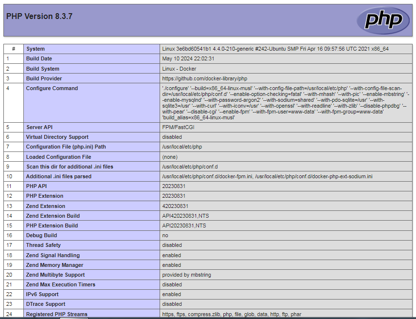
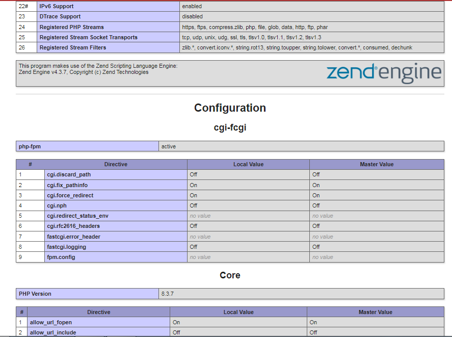
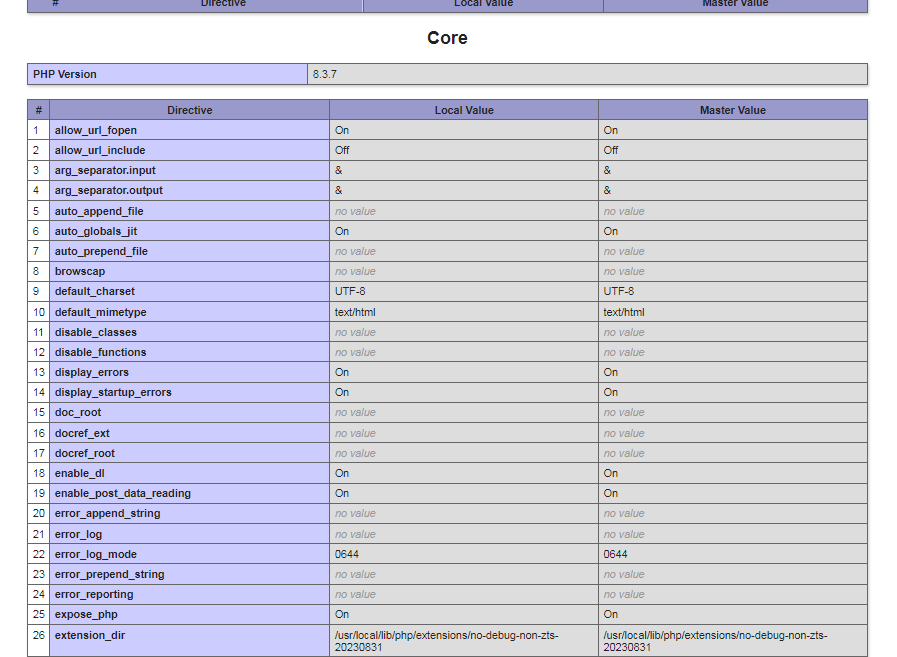
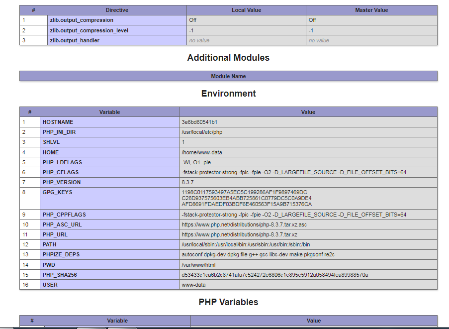

# Multi-Container-NGINX-Web-Server-with-PHP-FPM-using-Docker-Compose

This project demonstrates how to set up a multi-container NGINX web server with PHP-FPM using Docker Compose. It showcases the power of containerization and the ease of deploying and managing multi-container applications with Docker Compose. 

The project defines two services in the Docker Compose configuration file: nginx and php. The nginx service uses the official NGINX Docker image to serve web content, while the php service utilizes the lightweight PHP-FPM Docker image with the Alpine variant. 

The nginx service listens on port 80 inside the container and is mapped to port 8000 (or any other assigned port) on the host machine, allowing access to the NGINX web server. The project includes an NGINX configuration file that serves files from the /var/www/html directory, mounted as a volume from the www directory on the host. It also includes a location block that forwards PHP file requests to the php service running on port 8000.

A sample PHP file (index.php) with the phpinfo() function is included to demonstrate the functionality. When accessing the application URL, the NGINX web server serves the index.php file and forwards it to the PHP-FPM service for execution, displaying the PHP environment information in the web browser.

# Screenshots 

The following screenshots showcase the PHP information page rendered in the web browser, confirming the successful setup and integration of the containerized NGINX web server with the PHP-FPM service using Docker Compose,

## PHP Version

## Configuration

## Core

## Environment

# Support and Contact

If you have any questions, please feel free to contact me at [vasudevanswornampillai@gmail.com].

# License

This project is licensed under the **Apache 2.0 License**.

# Share with the community

If you find this project interesting or helpful, don't hesitate to share with your community! Let's learn and grow together!

# Conclusion

In this project, we’ve developed a multi-container NGINX web server with PHP-FPM using Docker Compose. The model, a beacon of performance, awaits those go into the beautiful world of Devops.
 

